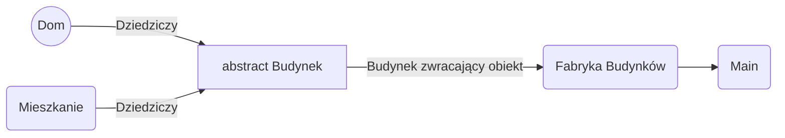
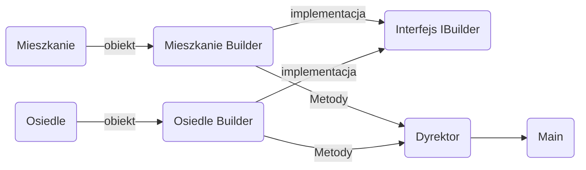

## Fabryka / Factory Method

```mermaid
graph LR
B((Dom)) -- Dziedziczy --> A[abstract Budynek]
C(Mieszkanie) -- Dziedziczy --> A
A -- Budynek zwracający obiekt --> D(Fabryka Budynków)
D --> M(Main)
```
## Budowniczy / Builder

```mermaid
graph LR
M(Main)
A(Mieszkanie)
B(Osiedle)
I(Interfejs IBuilder)
MB(Mieszkanie Builder)
OB(Osiedle Builder)
D(Dyrektor)
MB -- implementacja --> I
OB -- implementacja --> I
A -- obiekt --> MB
B -- obiekt --> OB
MB -- Metody --> D
OB -- Metody --> D
D --> M
```